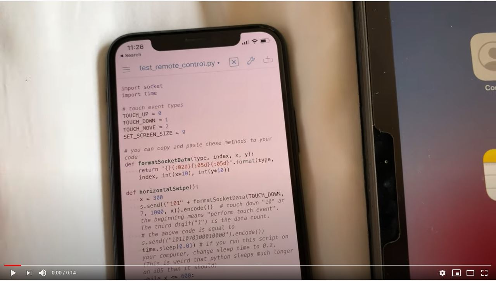
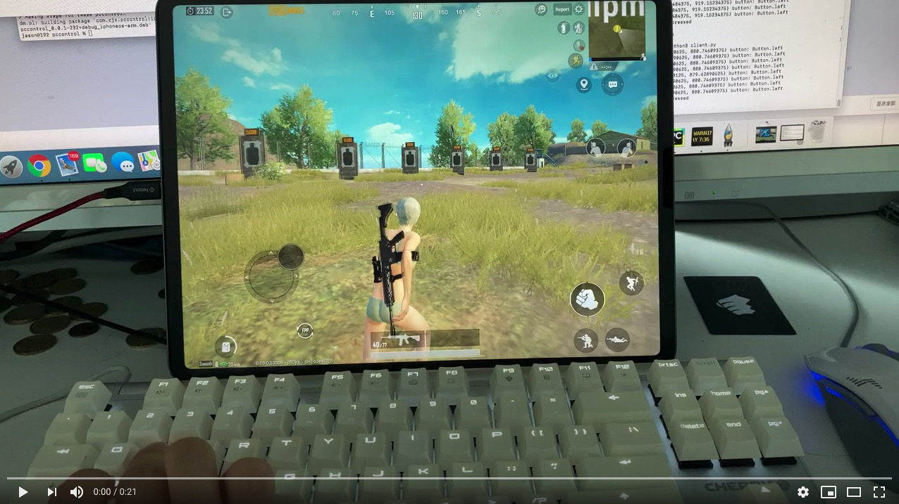

# IOS13-SimulateTouch V0.0.6

A **system wide** touch event simulation library for iOS 11.0 - 14.

Jailbroken device required. Application wide touch simulation library: [PTFakeTouch](https://github.com/Ret70/PTFakeTouch). Choose as you like:)

Discord: https://discord.gg/acSXfyz

Please give me a star!

Read this in other languages（send email to me if you want to help to translate this page）: [简体中文版说明文档](README.zh-cn.md)


## Description

This library enables you to simulate touch events on iOS 11.0 - 14 with just one line of code! Currently, the repository is mainly for programmers. In the future, I will make it suitable for people who do not understand how to code.

## Notice
I am a Computer Science student in University of Pittsburgh, and my spring 2021 term has started. My workload for this semester is pretty heavy. **Although this semester is extremely boring because I didn't enroll in any of the CS courses this semester, I still have to focus on studying. So, I have to reduce the amount of time spending on updating ZXTouch.** But I will still update it when I am free.


## Features

1. Touch Simulation
	* Multitouch supported (no other library you can find supports multi touching).
	* Programmable. Control scripts can be programmed with all the programming languages you desire.
	* Instant controlling supported. The ios device can be controlled with no latency from other devices/computers.
	* System-level touch simulation (will not inject to any process).
	* Touch recording. Record your touch event and play back.
2. GUI Application
3. Others
	* Application running.
	* System wide alert box displaying.
	* Shell accessing.
	* Color picker. Get the color of a specified pixel.
	* Image matching.
	* Device information
	* Battery information
	* Toast
	* Activator support
	* OCR
	* Touch indicator

## Upcoming Feature Updates
Submit suggestions on discord!


## Installation

### Through Cydia:
1. Open Cydia - Sources - Edit - Add - https://zxtouch.net (backup server: http://47.114.83.227  ("http" instead of "https"!!! Please double check this.))
2. Install ***"ZXTouch"*** tweak
3. Done

### Through Github:
1. Download **com.zjx.ioscontrol_0.0.6_iphoneos-arm.deb** from **release**
2. Copy the deb file to your iOS device
3. SSH to your iOS device and install the deb file by typing "dpkg -i /PATH/TO/om.zjx.pccontrol_0.0.2_iphoneos-arm.deb"


## Demo Usage
**Remote Controlling:**
You can control your iOS device from local scripts, computers, or even other iOS devices!
[](https://youtu.be/gdSGO6rJIL4)

**Instant Controlling:**
Here is a demo of PUBG Mobile.
[](https://youtu.be/XvvWHL6B3Tk)

**Recording & Playback:**
Record touch events and playback
[](https://youtu.be/WeYMx4z8N2M)


Demo #4: [Activator Support](https://youtu.be/BvkTg3LWxUQ)

Demo #5: [OCR](https://youtu.be/xt4BvgsSGkc)

Demo #6: [Touch Indicator](https://youtu.be/AU7zG_-W2tM)

Demo #7: [Text Input](https://youtu.be/UQqoiOBilBY)

Demo #8: [Color Picker](https://youtu.be/tserB05_B9E)


## Usage

See python version of documentation below. But you can also use ANY language to control your iOS device as long as the language supports socket. Here is how it works:

1. After installation, the tweak starts listening at port 6000.

2. To control your device, send data in certain format to port 6000 on your device. I will not list the detail format of data here, but you can read my python module source code to figure it out.


## Documentation (Python)

### Installation

1. **On Your iOS Device**: ZXTouch python module will be automatically installed on your iOS device.


2. **On Computers**: If you want to install ZXTouch python module on your computer for remote controlling, download the source code from [github](https://github.com/xuan32546/IOS13-SimulateTouch/tree/0.0.6/layout/usr/lib/python3.7/site-packages) and copy the zxtouch folder to your "site-packages" folder of your python on your computer.

### Create A ZXTouch Instance

To create a instance, use zxtouch(ip) where ip is the ip address of your device. If you want to run the script locally on your iOS device, just input "127.0.0.1".

```python
from zxtouch.client import zxtouch # import module
device = zxtouch("127.0.0.1") # create instance
```

### Instance Methods
[Touch](#Touch)

[Bring Application to Foreground](#bring-application-to-foreground)

[Show Alert Box](#show-alert-box)

[Run Shell Command As Root](#run-shell-command-as-root)

[Image Matching](#image-matching)

[Toast](#toast)

[Color Picker (RGB Value From A Point on Screen)](#color-picker-rgb-value-from-a-point-on-screen)

[Accurate Sleep](#accurate-sleep)

[Hide Keyboard](#hide-keyboard)

[Show Keyboard](#show-keyboard)

[Text Input](#text-input)

[Move Cursor](#move-cursor)

[Play A Script](#play-a-script)

[Force Stop Script Playing](#force-stop-script-playing)

[Get Screen Size](#get-screen-size)

[Get Screen Orientation](#get-screen-orientation)

[Get Screen Scale](#get-screen-scale)

[Get Device Information](#get-device-information)

[Get Battery Information](#get-battery-information)

[Start Touch Recording](#start-touch-recording)

[Stop Touch Recording](#stop-touch-recording)

[OCR](#OCR )

## Touch:

There are two methods you can use to send touch events. 

For a single touch event: 

```python
def touch(type, finger_index, x, y):
	"""Perform a touch event
	
	Args:
		type: touch event type. For touch event types, please insert "from zxtouch.touchtypes import *" at top of your script.
		finger_index: the finger index of the touch event. The range should be 1-19
		x: x coordinate of the screen
		y: y coordinate of the screen
	
	Returns: 
		None
	"""
```

For sending multiple touch events at the same time:

```python
def touch_with_list(self, touch_list: list):
    """Perform touch events with a list of events
    touch list should be type of list. Inside the list, there must be dictionaries with the following format

    Args:
    	touch_list: format example: [{"type": ?, "finger_index": ?, "x": ?, "y": ?}]
    	
    Returns: 
    	None
    """
```

**Code Example**

```python
# code example
from zxtouch.client import zxtouch
from zxtouch.touchtypes import *
import time

device = zxtouch("127.0.0.1") # create instance

# finger "5" touch (400, 400)
device.touch(TOUCH_DOWN, 5, 400, 400) # TOUCH_DOWN is imported from zxtouch.touchtypes
time.sleep(1)
# move to (400, 600)
device.touch(TOUCH_MOVE, 5, 400, 600) # TOUCH_MOVE is imported from zxtouch.touchtypes
time.sleep(1)
# touch up
device.touch(TOUCH_UP, 5, 400, 600) # TOUCH_UP is imported from zxtouch.touchtypes
time.sleep(1)

# multitouch point (300, 300) and (500, 500) at the same time
device.touch_with_list([{"type": TOUCH_DOWN, "finger_index": 1, "x": 300, "y": 300}, {"type": TOUCH_DOWN, "finger_index": 2, "x": 500, "y": 500}])
time.sleep(1)
device.touch_with_list([{"type": TOUCH_UP, "finger_index": 1, "x": 300, "y": 300}, {"type": TOUCH_UP, "finger_index": 2, "x": 500, "y": 500}])

device.disconnect()
```

## Bring Application to Foreground

```python
def switch_to_app(bundle_identifier):
	"""Bring an application to foreground
	
	Args:
		bundle_identifier: the bundle identifier of the application
	
	Returns: 
		Result tuple
		
		The format of the result tuple:
		result_tuple[0]: True if no error happens when executing the command on your device. False otherwise
		result_tuple[1]: error info if result_tuple[0] == False. Otherwise ""
	"""
```

**Code Example**

```python
from zxtouch.client import zxtouch

device = zxtouch("127.0.0.1") # create instance
device.switch_to_app("com.apple.springboard") # return to home screen

device.disconnect()
```

## Show Alert Box
 
```python
def show_alert_box(title, content, duration):
    """Show alert box on device

    Args:
        title: title of the alert box
        content: content of the alert box
        duration: the time the alert box shows before disappear

    Returns:
       Result tuple
		
		The format of the result tuple:
		result_tuple[0]: True if no error happens when executing the command on your device. False otherwise
		result_tuple[1]: error info if result_tuple[0] == False. Otherwise ""
    """
```

**Code Example**

```python
from zxtouch.client import zxtouch

device = zxtouch("127.0.0.1") # create instance
device.show_alert_box("Alert", "This is a system-wide alert box that lasts for 3 seconds", 3)

device.disconnect()
```


## Run Shell Command As Root
 
```python
def run_shell_command(command):
    """Run shell command on device as root
		
	Args:
    	command: command to run
        
    Returns:
       Result tuple
		
		The format of the result tuple:
		result_tuple[0]: True if no error happens when executing the command on your device. False otherwise
		result_tuple[1]: error info if result_tuple[0] == False. Otherwise ""
    """
```

## Image Matching

Match screen with a template image.

```python
def image_match(template_path, acceptable_value=0.8, max_try_times=4, scaleRation=0.8):
    """Match screen with a template image
		
	Args:
    	template_path: absolute path of the template image on your iOS device.
    	acceptable_value: for a success match, what is the similarity of the template and parts you want to match on the screen.
    	scaleRation: if match failed due to the size difference between template image and image on screen, what should the size of the template image be for the next try.
    	max_try_times: how many times to try.
        
    Returns:
       Result tuple
		
		The format of the result tuple:
		result_tuple[0]: True if no error happens when executing the command on your device. False otherwise
		result_tuple[1]: error info if result_tuple[0] == False. Otherwise a dictionary containing x, y, width, height of the template on screen. (see code example below)
		
		NOTICE: result_tuple[0] == True does not mean a success match, it only means no error happens while matching. To check whether it is a success match, check the width and height of the returned dictionary. If both width and height == 0, then it means match failed.
    """
```

**Code Example**

```Python
from zxtouch.client import zxtouch

device = zxtouch("127.0.0.1") # create instance
result_tuple = device.image_match("/var/mobile/Library/ZXTouch/scripts/examples/Image Matching.bdl/examples_folder.jpg", 0.8, 5, 0.85) # try 5 times with acceptable value 0.8. Each time  make template image size*1.5 AND size/1.5 then match again.

if not result_tuple[0]:
	print("Error happens while matching template image. Error info: " + result_tuple[1])
else:
	result_dict = result_tuple[1]
	if float(result_dict["width"]) != 0 and float(result_dict["height"]) != 0:
		print("Match success! X: " + result_dict["x"] + ". Y: " + result_dict["y"] + ". Width: " + result_dict["width"] + ". Height: " + result_dict["height"])
	else:
		print("Match failed. Cannot find template image on screen.")
		
device.disconnect()
```

## Toast

```python
def show_toast(toast_type, content, duration, position=0, fontSize=0):
	"""show a toast
	
	Args:
        type: type of the toast. Please import zxtouch.toasttypes for the constant.
        content: content of the toast
        duration: how long the toast will appear before disappearing
        position: position of the toast. Please import zxtouch.toasttypes for the constant.
        
        For more information about the constants, please see code example below
	
	Returns: 
       Result tuple
		
		The format of the result tuple:
		result_tuple[0]: True if no error happens when executing the command on your device. False otherwise
		result_tuple[1]: error info if result_tuple[0] == False. Otherwise ""	"""
```

**Code Example**

```python
from zxtouch.client import zxtouch
from zxtouch.toasttypes import *
import time

device = zxtouch("127.0.0.1") # create instance
device.show_toast(TOAST_SUCCESS, "This is an success message toast", 1.5)
time.sleep(1.5)

device.show_toast(TOAST_ERROR, "This is an error message toast", 1.5)
time.sleep(1.5)

device.show_toast(TOAST_WARNING, "This is an warning message toast", 1.5)
time.sleep(1.5)

device.show_toast(TOAST_MESSAGE, "This is an normal message toast", 1.5)
time.sleep(1.5)

device.show_toast(TOAST_ERROR, "Toast can also be shown at bottom", 3, TOAST_BUTTOM)


device.disconnect()
```

## Color Picker (RGB Value From A Point on Screen)

```python
def pick_color(x, y):
    """Get the rgb value from the screen.
		
	Args:
   		x: x coordinate of the point on the screen
   		y: y coordinate of the point on the screen

    Returns:
       Result tuple
		
		The format of the result tuple:
		result_tuple[0]: True if no error happens when executing the command on your device. False otherwise
		result_tuple[1]: error info if result_tuple[0] == False. Otherwise a dictionary containing red, green, blue of the point on screen.  
    """
```

**Code Example**

```Python
from zxtouch.client import zxtouch
import time

device = zxtouch("127.0.0.1")
print("Picking color from 100, 100 after 1.5 seconds...")
time.sleep(1.5)
result_tuple = device.pick_color(100, 100)
if not result_tuple[0]:
    print("Error while getting color. Error info: " + result_tuple[1])
else:
    result_dict = result_tuple[1]
    print("Red: " + result_dict["red"] + ". Green: " + result_dict["green"] + ". Blue: " + result_dict["blue"])
		
device.disconnect()
```


## Accurate Sleep

I don't know the why, but if you call `time.sleep` in python, the sleep time will not be accurate. However you can use accurate_sleep method in zxtouch to sleep for an accurate time.

 
```python
def accurate_usleep(microseconds):
    """Sleep for an accurate time
		
	Args:
    	microseconds: microseconds to sleep
        
    Returns:
       Result tuple
		
		The format of the result tuple:
		result_tuple[0]: True if no error happens when executing the command on your device. False otherwise
		result_tuple[1]: error info if result_tuple[0] == False. Otherwise ""
    """
```

## Hide Keyboard

If the keyboard is showing, hide the keyboard

```python
def hide_keyboard():
    """Hide the keyboard
    	        
    Returns:
       Result tuple
		
		The format of the result tuple:
		result_tuple[0]: True if no error happens when executing the command on your device. False otherwise
		result_tuple[1]: error info if result_tuple[0] == False. Otherwise ""
    """
```

## Show Keyboard

If the keyboard is hiding, show the keyboard

```python
def show_keyboard():
    """Show the keyboard
    	        
    Returns:
       Result tuple
		
		The format of the result tuple:
		result_tuple[0]: True if no error happens when executing the command on your device. False otherwise
		result_tuple[1]: error info if result_tuple[0] == False. Otherwise ""
    """
```

## Text Input

Insert text to the current text field. If you want to delete characters, please call this method like this: `device.insert_text("\b")`

```python
def insert_text(text):
    """Insert text to the textfield
    
    Args:
    	text: text to insert (\b for deleting characters)
    	        
    Returns:
       Result tuple
		
		The format of the result tuple:
		result_tuple[0]: True if no error happens when executing the command on your device. False otherwise
		result_tuple[1]: error info if result_tuple[0] == False. Otherwise ""
    """
```

## Move Cursor

Move the text cursor on textfield

```python
def move_cursor(offset):
    """Move the cursor
		
	Args:
		offset: the related position you want to move. To move left, offset should be negative. For moving right, it should be positive
		    	        
    Returns:
       Result tuple
		
		The format of the result tuple:
		result_tuple[0]: True if no error happens when executing the command on your device. False otherwise
		result_tuple[1]: error info if result_tuple[0] == False. Otherwise ""
    """
```

## Play A Script

Play a zxtouch script on iOS device.

```python
def play_script(script_absolute_path):
    """Play a zxtouch script on iOS device.
		
	Args:
    	script_absolute_path: absolute path of the script
    	        
    Returns:
       Result tuple
		
		The format of the result tuple:
		result_tuple[0]: True if no error happens when executing the command on your device. False otherwise
		result_tuple[1]: error info if result_tuple[0] == False. Otherwise ""
    """
```

## Force Stop Script Playing

Force the device to stop playing current script

```python
def force_stop_script_play():
    """Force stop playing a script
		
	Args:
		None
				    	        
    Returns:
       Result tuple
		
		The format of the result tuple:
		result_tuple[0]: True if no error happens when executing the command on your device. False otherwise
		result_tuple[1]: error info if result_tuple[0] == False. Otherwise ""
    """
```


## Get Screen Size

```python
def get_screen_size():
    """Get screen size in pixels
		
	Args:
		None
				    	        
    Returns:
       Result tuple
		
		The format of the result tuple:
		result_tuple[0]: True if no error happens when executing the command on your device. False otherwise
		result_tuple[1]: error info if result_tuple[0] == False. Otherwise a dictionary containing width and height of the screen.
							format of the dicionary: {"width": ?, "height": ?}
    """
```

## Get Screen Orientation

```python
def get_screen_orientation():
    """Get orientation of the screen
		
	Args:
		None
				    	        
    Returns:
       Result tuple
		
		The format of the result tuple:
		result_tuple[0]: True if no error happens when executing the command on your device. False otherwise
		result_tuple[1]: error info if result_tuple[0] == False. Otherwise the orientation of the screen. An int value in str format indicating the orientation.
    """
```

## Get Screen Scale

```python
def get_screen_scale():
    """Get scale of the screen
		
	Args:
		None
				    	        
    Returns:
       Result tuple
		
		The format of the result tuple:
		result_tuple[0]: True if no error happens when executing the command on your device. False otherwise
		result_tuple[1]: error info if result_tuple[0] == False. Otherwise the scale of the screen. An int value in str format indicating the scale.
    """
```

## Get Device Information

```python
def get_device_info():
    """Get information of the device
		
	Args:
		None
				    	        
    Returns:
       Result tuple
		
		The format of the result tuple:
		result_tuple[0]: True if no error happens when executing the command on your device. False otherwise
		result_tuple[1]: error info if result_tuple[0] == False. Otherwise a dictionary containing name, system_name, system_version, model, identifier_for_vendor.
							format of the dicionary: {"name": ?, "system_name": ?, "system_version": ?, "model": ?, "identifier_for_vendor": ?}
    """
```

## Get Battery Information

```python
def get_battery_info():
    """Get information of the battery
		
	Args:
		None
				    	        
    Returns:
       Result tuple
		
		The format of the result tuple:
		result_tuple[0]: True if no error happens when executing the command on your device. False otherwise
		result_tuple[1]: error info if result_tuple[0] == False. Otherwise a dictionary containing battery_state, battery_level, battery_state_string.
							format of the dicionary: {"battery_state": ?, "battery_level": ?, "battery_state_string": ?}
    """
```

## Start Touch Recording

```python
def start_touch_recording():
    """Start recording touch events. If success, there will be a red indicator at the top of your screen.
		
	Args:
    	None
        
    Returns:
       Result tuple
		
		The format of the result tuple:
		result_tuple[0]: True if no error happens when executing the command on your device. False otherwise
		result_tuple[1]: error info if result_tuple[0] == False. Otherwise ""
    """
```

## Stop Touch Recording

```python
def stop_touch_recording():
    """Stop recording touch events. You can also double click volumn down button to stop recording
		
	Args:
    	None
        
    Returns:
       Result tuple
		
		The format of the result tuple:
		result_tuple[0]: True if no error happens when executing the command on your device. False otherwise
		result_tuple[1]: error info if result_tuple[0] == False. Otherwise ""
    """
```

## OCR 

```python
def ocr(self, region, custom_words=[], minimum_height="", recognition_level=0, languages=[], auto_correct=0, debug_image_path=""):
    """Get text from a region

    Args:
        region: a tuple containing start_x, start_y, width, height of the region to ocr. Format: (x, y, width, height)
        custom_words: an array of strings to supplement the recognized languages at the word recognition stage.
        minimum_height: the minimum height of the text expected to be recognized, relative to the image height. The default value is 1/32
        recognition_level: a value that determines whether the request prioritizes accuracy or speed in text recognition. 0 means accurate. 1 means faster.
        languages: an array of languages to detect, in priority order.  Default: english. Use get_supported_ocr_languages() to get the language list.
        auto_correct: whether ocr engine applies language correction during the recognition process. 0 means no, 1 means yes
        debug_image_path: debug image path. If you DONT want the ocr engine to output the debug image, leave it blank

    Returns:
        Result tuple: (success?, error_message/return value)

        if the operation successes, the return value will be an array of texts in the region.
    """
```

```python
def get_supported_ocr_languages(self, recognition_level):
    """Get languages that can be recognized by ocr

    Args:
        recognition_level: a value that determines whether the request prioritizes accuracy or speed in text recognition. 0 means accurate. 1 means faster.

    Returns:
        Result tuple: (success?, error_message/return value)

        if the operation successes, the return value will be an array of available languages .
    """
```

## Contact

Mail: jiz176@pitt.edu

Discord: https://discord.gg/acSXfyz
