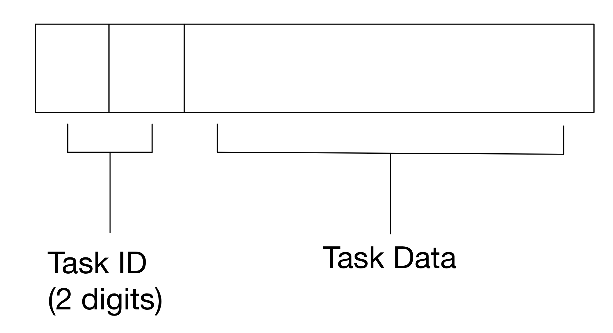
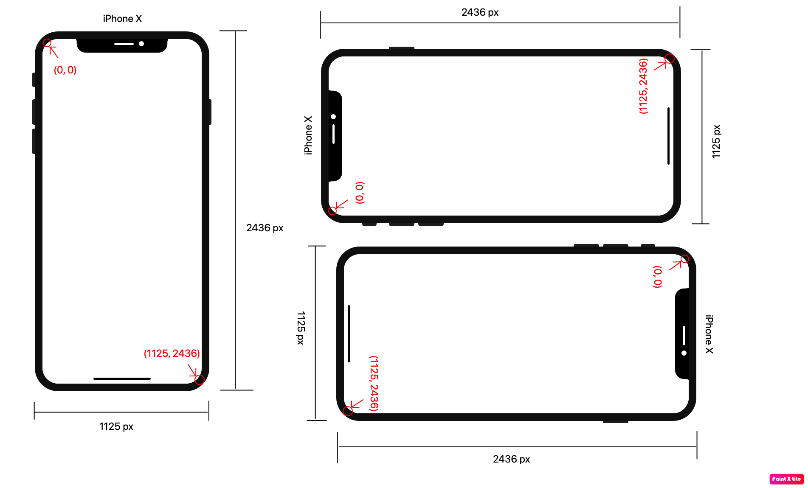

# IOS13-SimulateTouch V0.0.2

A **system wide** touch event simulation library for iOS 11.0 - 13.6.

Jailbroken device required. Application wide touch simulation library: [PTFakeTouch](https://github.com/Ret70/PTFakeTouch). Choose as you like:)

Discord: https://discord.gg/acSXfyz

Please give me a star! I will post updates on Github.

## About Open Source

The reason that I haven't release the source is that I wrote the code while doing iOS reverse engineering, so the code is like a mess. It is bad structured and unreadable now (and I don't want anyone to see bad code written by me). So I have to rewrite some parts of the source code to make it tidy and readable before releasing it. I don't have enough time for it so I can just post a release version for you guys to get it tested first. And during this time, I have to make sure that no one will make illegal things based on the library.

But I can promise you that this repo is FREE and NOT for my own benefit. I will definitely release the source code shortly. Please star or watch this library to get notified when I post the source code.

Sorry for the inconvenience.

## Description

This library enables you to simulate touch events on iOS 11.0 - 13.6 with just one line of code! All the source code will be released later.

## Features

1. Touch Simulation
	* Multitouch supported (no other library you can find supports multi touching).
	* Programmable. Control scripts can be programmed with all the programming languages you desire.
	* Instant controlling supported. The ios device can be controlled with no latency from other devices/computers.
	* System-level touch simulation (will not inject to any process).
2. GUI Application
	* Script shop to download scripts.
	* Write your own script.
3. Others
	* Application running.
	* System wide alert box displaying.
	* Shell accessing.

## Upcoming Feature Updates (ALL FREE & OPEN SOURCE!)
1. GUI Application
	* Color picker. Get the color of a specified pixel.
	* Touch recording. Record your touch event and play back.
	* Image matching.
2. Others
	* Physical buttons simulations.
	* Submit suggestions on discord!


## Installation

1. Open Cydia - Sources - Edit - Add - http://47.114.83.227 ("http" instead of "https"!!! Please double check this.)
2. Install ***"ZJXTouchSimulation"*** tweak
3. Done

## Code Example

`Python Version`

```Python
import socket
import time

# touch event types
TOUCH_UP = 0
TOUCH_DOWN = 1
TOUCH_MOVE = 2
SET_SCREEN_SIZE = 9

# you can copy and paste these methods to your code
def formatSocketData(type, index, x, y):
    return '{}{:02d}{:05d}{:05d}'.format(type, index, int(x*10), int(y*10))

def horizontalSwipe():
    x = 300
    s.send(("101" + formatSocketData(TOUCH_DOWN, 7, x, 1000)).encode())  # touch down "10" at the beginning means "perform touch event". The third digit("1") is the data count.
    # the above code is equal to s.send(("1011070300010000").encode())
    time.sleep(0.01) # if you run this script on your computer, change sleep time to 0.2. (This is weird that python sleeps much longer on iOS than it should)
    while x <= 600:
        s.send(("101" + formatSocketData(TOUCH_MOVE, 7, x, 1000)).encode())  # move our finger 7 to the right
        x += 5
        time.sleep(0.01)

    while x >= 100:
        s.send(("101" + formatSocketData(TOUCH_MOVE, 7, x, 1000)).encode())  # move our finger 7 to the left
        x -= 5
        time.sleep(0.01)

    s.send(("101" + formatSocketData(TOUCH_UP, 7, x, 1000)).encode())  # release finger

if __name__ == '__main__':
    s = socket.socket()
    s.connect(("127.0.0.1", 6000))  # connect to the tweak
    time.sleep(0.1)  # please sleep after connection.

    # the format should be "{task_id(2 digits)}{task_data}"
    #############   switch application to foreground part   ##############
    s.send("11com.apple.Preferences".encode())  # 11 at head means the task is id 11 (launch app). Move application "com.apple.Preferences" to the foreground" (launch settings app)
    time.sleep(1)

    #############   show system wide alert box part   ##############
    s.send("12This Is Title;;Title and content should be splitted by two semicolons. I am going to close settings in 5 seconds.".encode())  # 12 at head means the task id is 12 (show alert). Title and content should be splitted by two semicolons.
    time.sleep(5)

    #############   shell access as root    ##############
    s.send("13killall Preferences".encode())  # 13 at head means the task id is 13 (run shell command). The shell command here is "killall Prefernces", which kills the settings app.
    time.sleep(1)

    # let's look at the sending touch event part
    # the task id for touching is 10. So if you want to touch down at some point, you have to send "10" + "1" + formatSocketData(TOUCH_DOWN, 7, x, 1000). 10 at head means the task id is 10 (touch event). "1" means event count is 1
    # Other things keep the same as the old version.
    s.send("11com.apple.springboard".encode())  # return to home screen
    horizontalSwipe() # preform swipe


    s.close()
```

Actually the touch is performed by only one line: 

```Python
s.send(("101"+formatSocketData(TOUCH_DOWN, 7, 300, 400)).encode()) 
```

Neat and easy. 

Perform Touch Move

```Python
s.send(("101"+formatSocketData(TOUCH_MOVE, 7, 800, 400)).encode())  # tell the tweak to move our finger "7" to (800, 400)
```

Perform Touch Up

```Python
s.send(("101"+formatSocketData(TOUCH_UP, 7, 800, 400)).encode())  # tell the tweak to touch up our finger "7" at (800, 400)
```

Combining them

```Python
s.send(("101"+formatSocketData(TOUCH_DOWN, 7, 300, 400)).encode())
time.sleep(1)
s.send(("101"+formatSocketData(TOUCH_MOVE, 7, 800, 400)).encode())
time.sleep(1)
s.send(("101"+formatSocketData(TOUCH_UP, 7, 800, 400)).encode())
```

First the finger touches (300, 400), and then it moves to (800, 400), and then "leaves" the screen. All the touch events are performed with no latency.

The following method is written for you to copy & paste to your code

```Python
# touch event types
TOUCH_UP = 0
TOUCH_DOWN = 1
TOUCH_MOVE = 2
SET_SCREEN_SIZE = 9

# you can copy and paste these methods to your code
def formatSocketData(type, index, x, y):
    return '{}{:02d}{:05d}{:05d}'.format(type, index, int(x*10), int(y*10))


def performTouch(socket, event_array):
    """Perform touch events

    Perform touch events in event_array. event_array should be an array containing dictionaries of touch events. The format of the dictionaries: {"type": touch type, "index": finger index, "x": x coordinate, "y": y coordinate}

    Args:
        socket: socket instance that connects to ZJXTouchSimulation tweak
        event_array: array of touch event dictionaries

    Returns:
        None

    Demo usage:
        performTouch(s, [{"type": 1, "index": 3, "x": 100, "y": 200}]) # touch down at (100, 300) with finger "3"
    """
    event_data = ''
    for touch_event in event_array:
        event_data += formatSocketData(touch_event['type'], touch_event['index'], touch_event['x'], touch_event['y'])
    socket.send('10{}{}'.format(len(event_array), event_data))

def switchAppToForeground(socket, app_identifier):
    """Bring application to foregound

    Args:
        socket: socket instance that connects to ZJXTouchSimulation tweak
        app_identifier: iOS application bundle identifier.

    Returns:
        None

    Demo Usage:
        switchAppToForeground(s, "com.apple.springboard") # returns to home screen
    """
    socket.send('11{}'.format(app_identifier).encode())

def showAlertBox(socket, title, content):
    """Show a system wide alert box

    Args:
        socket: socket instance that connects to ZJXTouchSimulation tweak
        title: title of the alert box
        content: content of the alert box

    Returns:
        None

    Demo Usage:
        showAlertBox(s, "Low Battery", "10% of battery remaining") # just a joke
    """
    socket.send('12{};;{}'.format(title, content).encode())

def executeCommand(socket, command_to_run):
    """Execute shell command with root privileges

    Args:
        socket: socket instance that connects to ZJXTouchSimulation tweak
        command_to_run: command that you want to execute

    Returns:
        None

    Demo Usage:
        executeCommand(s, "reboot") # reboot your device
    """
    socket.send('13{}'.format(command_to_run).encode())
```

## Demo Usage - iOS Game Controller

I write scripts using python to let myself play iOS games using the keyboard and mouse of my computer. Here are demos of Fortnite and PUBG Mobile.
[](https://youtu.be/XvvWHL6B3Tk)
[](https://youtu.be/mCkTzQJ2lC8)

## Usage (expired. Will be updated soon)

After installation, the tweak starts listening at port 6000.

What you have to do is:
1. Connection to the tweak using socket.
2. Send the task data to the tweak (you have to follow the format specified below).

### The format of the whole data


**The data consists of two parts, task ID part (2 digits) and task data part.**

**** 
### Task ID format
task id should be a 2-digit integer

Task id table:

| Task       | Task ID | Description                                               |
|:----------:|:----:|:---------------------------------------------------------:|
| Reserved | < 10 | Reserved for future use |
| Touch Simulation   | 10   | Simulate touch events                     |
| Running Application  | 11    | Bring the application specified to foreground (run the app if not running)  |
| Alert Box Displaying | 12    | Display a system wide alert box |
| Shell Accessing   | 13    | Access shell with root privileges      |
| Comming soon | > 13 | Comming soon (you can submit suggestions via discord or email) |


****

### Task Data Format

* [Touch Simulation](#sending-touch-events)
* [Application Running]()
* [System Wide Alert Box Displaying]()
* [Shell Accessing]()

***1. Touch Simulation***

task data should always be decimal digits, specified below


`Event Count`(1 digit): Specify the count of the single events. If you have multiple events to send at the same time, just increase the event count and append events to the data.

`Type`(1 digit): Specify the type of the single event. 

Supported event type:

| Event      | Flag | Description                                               |
|:----------:|:----:|:---------------------------------------------------------:|
| Touch Up   | 0    | Specify the event as a touch-up event                     |
| Touch Down | 1    | Specify the event as a touch-down event                   |
| Touch Move | 2    | Specify the event as a touch-move event (move the finger) |
| Set Size   | 9    | Set screen size (deprecated)      |

`Touch Index`(2 digits): Apple supports multitouch, so you have to specify the finger index when posting touching events. The range of finger index is 1-20 (0 is reserved, don't use 0 as finger index). 

`x Coordinate`(5 digits): The x coordinate of the place you want to touch. The first 4 digit is for integer part while the last one is for the decimal part. For example, if you want to touch (123.4, 2432.1) on the screen, you should fill "01234" for this.

`y Coordinate`(5 digits): The y coordinate of the place you want to touch. The first 4 digit is for integer part while the last one is for the decimal part. For example, if you want to touch (123.4, 2432.1) on the screen, you should fill "24321" for this.

### Important Note

The touch coordinate does not depend on the orientation of your device. See picture below to get more information. However you place your device, the click point on the screen will **not** be changed.



***2. Application Running***

Task data should be the the bundle identifier of app you want to run.

For example, if you want to run "settings" app, the task data should be **"com.apple.Preferences"**. So the entire data that should be sent to the tweak is **"11com.apple.Preferences"** (11 is the task id).

**[appster](http://cydia.saurik.com/package/com.jake0oo0.appster/)** might help for finding bundle id.

***3. System Wide Alert Box Displaying***

An alert box consists of title and content. The title and content you want to show should be splitted by two semicolons (";;"). The alert box is system wide.

For example, if you want to emulate a "low battery" alert box to trick your friend, just send "12Low Battery;;10% of battery remaining". (12 is the task id)

***4. Shell Accessing as Root***

You can access shell with root privileges by setting the task id to 13. The task data should be the shell command you want to execute. **Caution: executing shell command as root is powerful but dangerous.**

For example, if you want to reboot your device, just send "13reboot". If you want to respring, send "13killall SpringBoard". (13 is the task id)


## Contact

Mail: jiz176@pitt.edu

Discord: https://discord.gg/acSXfyz
